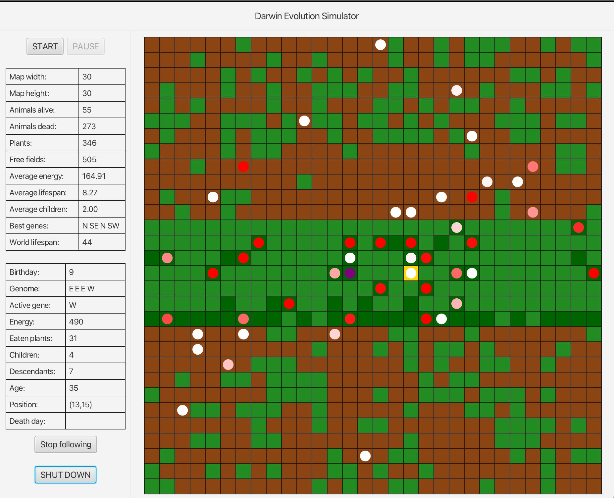

## Darwin Simulator

This is a Java-based simulation of an ecosystem where animals move, eat, and reproduce. The project is structured using the Model-View-Presenter pattern and uses Gradle as a build tool.

## Configuration

You can modify the simulation configuration by editing the [`config`](command:_github.copilot.openSymbolInFile?%5B%22src%2Fmain%2Fjava%2Fagh%2Fics%2Foop%2Fsimulation%2FSimulation.java%22%2C%22config%22%5D "src/main/java/agh/ics/oop/simulation/Simulation.java") files in the [`src/main/resources`](command:_github.copilot.openRelativePath?%5B%22src%2Fmain%2Fresources%22%5D "src/main/resources") directory. A few of available options are:

- `animalsCount`
- `mapSize`
- `plantsCount`
- `animalEnergy`

## Building and running the Project

The project uses Gradle for building and managing dependencies. To build the project, navigate to the project root directory and run the following command in your terminal:

```sh
./gradlew build
```

To run the simulation, use the following command:

```sh
./gradlew run
```

This will start the simulation with the default configuration. You can modify the configuration by editing the [`config`](command:_github.copilot.openSymbolInFile?%5B%22src%2Fmain%2Fjava%2Fagh%2Fics%2Foop%2Fsimulation%2FSimulation.java%22%2C%22config%22%5D "src/main/java/agh/ics/oop/simulation/Simulation.java") files in the [`src/main/resources`](command:_github.copilot.openRelativePath?%5B%22src%2Fmain%2Fresources%22%5D "src/main/resources") directory.

## Video

A video presenting all the functions of the application: [YouTube](https://youtu.be/ad2iWNOSuzI)

## Concept

You can find detailed description for this project on [GitHub](https://github.com/Soamid/obiektowe-lab/tree/master/proj)

## Screenshots
